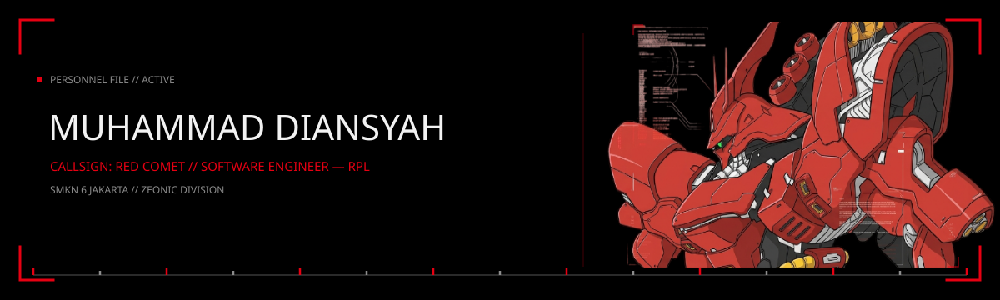
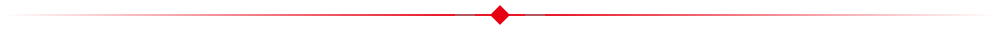
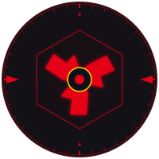
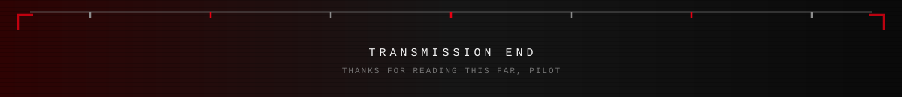

<div align="center">




</div>

<br>



<table width="100%">
<tr>
<td width="160" align="center" valign="top">



</td>
<td valign="top">

```
> SYSTEM STATUS ________________________________

  [ONLINE]   Transmission Log
  [ONLINE]   Deployed Units
  [ONLINE]   Proficiency Readout
  [ONLINE]   Equipment & Armaments
  [ONLINE]   Operations Log
  [ONLINE]   Sortie Records
  [ONLINE]   Communication Channel
```

</td>
</tr>
</table>

Started out messing with HTML and CSS in school, now I build full working systems. A stock trading dashboard with real IDX-specific rules, a finance tracker built for students, a map rendering sixty thousand airports from raw data. Most of what's below started as "let's see if I can" and turned into something people can actually use.


## TRANSMISSION LOG — OFF DUTY

- 👋 Hi, I'm Diansyah, goes by ssky online
- 🪖 Into gunpla builds and baseball outside of code
- 🌱 Currently leveling up my front-end, backend's always been the comfort zone
- 🤝 Open to collaborating if you've got a project worth building
- 💬 Discord is the fastest way to reach me — sskyier
- 😄 He/him
- ⚡ Based in Indonesia


## DEPLOYED UNITS

No favorites here — everything gets the same readout.

| Unit | Classification | Stack | Status |
|---|---|---|---|
| IDX Trading Analyzer | Trading tool | FastAPI, SQLite, Gemini AI | Active |
| Kopi Senja | Client project | PHP, MySQL | Completed |
| PocketTrack | Finance tracker | Web app | In development |
| Projost Academy | School project | PHP, MySQL | Completed |
| Skyport | Interactive map / portfolio | Laravel, Leaflet.js, MySQL | Completed |

<!-- TODO: point each row to its actual repo, e.g. [IDX Trading Analyzer](https://github.com/di4nsyah/idx-trading-analyzer) -->


## PROFICIENCY READOUT

```
  HTML / CSS       ███████████████████░  95%
  JavaScript       ████████████████░░░░  80%
  PHP               ██████████████████░░  90%
  Laravel          ████████████████░░░░  80%
  MySQL            ███████████████░░░░░  75%
  C# / .NET        ██████████░░░░░░░░░░  50%
```

<sub>Self-assessed — adjust the bars to whatever feels honest.</sub>


## EQUIPMENT & ARMAMENTS

**Languages**


**Frameworks & Libraries**


**Tools**


## OPERATIONS LOG

<div align="center">

<picture>
  <source media="(prefers-color-scheme: dark)" srcset="https://raw.githubusercontent.com/di4nsyah/di4nsyah/output/snake-dark.svg" />
  <source media="(prefers-color-scheme: light)" srcset="https://raw.githubusercontent.com/di4nsyah/di4nsyah/output/snake-light.svg" />
  
</picture>

</div>

<!-- This only shows up once snake.yml has been added to .github/workflows/ and has run at least once -->


## SORTIE RECORDS

<div align="center">


</div>


## COMMUNICATION CHANNEL

<div align="center">

[](https://www.linkedin.com/in/muhammad-diansyah-926aba343/)
[](mailto:dnsxyh@gmail.com)
[](mailto:m.diansyahputra42@gmail.com)
[](https://discord.com/users/sskyier)

</div>

<br>

<div align="center">


<br><br>



</div>
